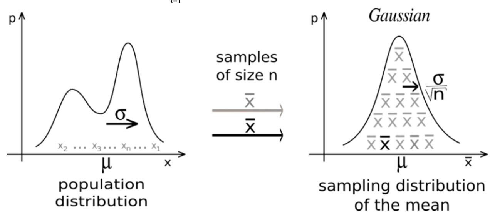

# AB Test in detail

This blog deals with detail mathematical derivation of some of the key concepts in AB Test.

## Some terminologies

**Alpha** ($\alpha$): P(reject $H_{o}$ | $H_{o}$ is true) \
**Confidence (1 - $\alpha$)**: P(keep $H_{o}$ | $H_{o}$ is true) \
**Beta** ($\beta$): P(reject $H_{a}$ | $H_{a}$ is true)\
**Power (1 -$\beta$)**: P(reject $H_{o}$ | $H_{a}$ is true)\
**$\Delta$**: Minimum effect to be detected, generally defined as ($\mu_{o}$ - $\mu_{a}$), is the amount of change you want to detect\
**$\sigma$**: standard deviation of both treatment and control in case of unequal standard devition. Use formula $\sqrt(n_{c}\sigma_{c}^2 + n_{t}\sigma_{t}^2)/(n_{c} + n_{t})$

## Derivation

Law of large number and Central Limit Theorem.
Let $x_{i}$ be sequence of IID random variables drawn from distribution having fnite expected value and standard devaition.

We are interested in $\overline{X_{n}}$ = $\frac{X_{1} + X_{2} ... + X_{n}}{n}$

By the law of large numbers as $\lim_{n\to\infty}$  $\overline{X_{n}}$  approches its true mean.

In our AB test scenerio, $A_{n} \to A$ and $B_{n} \to B$

Variance Properties:
* If X and Y are independent Var(X + Y) = Var(X) + Var(Y)
* Var(aX) = $a^2$ Var(X)

Var($\overline{X_{n}}$) = Var($\frac{X_{1} + X_{2} ... + X_{n}}{n}$)
Since $X_{i}$ are iid

Var($\overline{X_{n}}$) = $\frac{\sigma^2}{n}$

$\overline{X_{n}}$ $\thicksim$ $N(\mu, \frac{\sigma}{\sqrt{n}})$

Var($\overline{X_{n}}$) = $\frac{\sigma^2}{n}$\
Using above properties, scaling $\overline{X_{n}}$ by $\frac{\sqrt{n}}{\sigma}$ will result in unit variance

Var($\frac{\sqrt{n}}{\sigma}\overline{X_{n}}$) = 1

$\frac{\sqrt{n}}{\sigma}\overline{X_{n}}$ $\thicksim$ $N(\mu, 1)$

Generally $\mu$ is considered zero for null hypothesis

Let $\Phi(x)$ be cumulative distribution function for N(0, 1)

**Controlling for false postives**: ($\alpha$): P(reject $H_{o}$ | $H_{o}$ is true)

this will happend when $\frac{\sqrt{n}}{\sigma}\overline{X_{n}}$ > $\Phi^{-1}(1-\alpha)$
this means reject $H_{o}$ if $\overline{X_{n}}$ > $\frac{\sigma}{\sqrt{n}}$ $\Phi^{-1}(1-\alpha)$

Depending on the wheather test is one tailed or two tailed, select favourable region.

**Controlling for false negatives**

the value of $\mu_{a}$ is $\Delta$ (from the defnition of MDE)

$\frac{\sqrt{n}}{\sigma}\overline{X_{n}}$ $\thicksim$ $N(\Delta, 1)$

$\frac{\sqrt{n}}{\sigma}(\overline{X_{n}} - \Delta)$ $\thicksim$ $N(0, 1)$

P(reject $H_{a}$ | $H_{a}$ is true) or P(keep $H_{o}$ | $H_{a}$ is true) $\leq$ $\beta$

We are going to keep $H_{o}$ when $\overline{X_{n}}$ $\leq$ $\frac{\sigma}{\sqrt{n}}$ $\Phi^{-1}(1-\alpha)$

P(keep $H_{o}$ | $H_{a}$ is true)

Lets write $H_{a}$ is true as $H_{a}$

$$
P(\overline{X_{n}} \leq \frac{\sigma}{\sqrt{n}} \Phi^{-1}(1-\alpha) | H_{a})
$$

Adding $\Delta$ and Substracting $\Delta$ 

$$
P(\Delta -\Delta + \overline{X_{n}} \leq \frac{\sigma}{\sqrt{n}} \Phi^{-1}(1-\alpha) | H_{a} )

$$

$$
P(\Delta  + \overline{X_{n}} -\Delta \leq \frac{\sigma}{\sqrt{n}} \Phi^{-1}(1-\alpha) | H_{a})

$$

$$
P(\overline{X_{n}} -\Delta \leq \frac{\sigma}{\sqrt{n}} \Phi^{-1}(1-\alpha) - \Delta | H_{a})
$$

$$
P( \frac{\sqrt{n}}{\sigma}(\overline{X_{n}} -\Delta) \leq  \Phi^{-1}(1-\alpha) - \frac{\sqrt{n}}{\sigma} \Delta | H_{a})
$$

Since $H_{a}$ is true 
$$
\Phi(\Phi^{-1}(1-\alpha) - \frac{\sqrt{n}}{\sigma}\Delta) \leq \beta
$$

$$
\Phi^{-1}(1-\alpha) - \frac{\sqrt{n}}{\sigma}\Delta \leq \Phi^{-1}(\beta)
$$

$$
\Phi^{-1}(1-\alpha) - \Phi^{-1}(\beta)\leq  \frac{\sqrt{n}}{\sigma}\Delta 
$$

$$
\frac{\sigma}{\Delta} (\Phi^{-1}(1-\alpha) - \Phi^{-1}(\beta))\leq  \sqrt{n}
$$

$$
\left[\frac{\sigma}{\Delta} (\Phi^{-1}(1-\alpha) - \Phi^{-1}(\beta))\right]^2\leq n
$$
Since $\Phi$ is symmetrical function, this can be written as 
$$
\left[\frac{\sigma}{\Delta} (\Phi^{-1}(1-\alpha) + \Phi^{-1}(1- \beta))\right]^2\leq n
$$

## Reference
[https://rugg2.github.io/AB%20testing%20-%20a%20simple%20explanation%20of%20what%20power%20analysis%20does.html)](https://rugg2.github.io/AB%20testing%20-%20a%20simple%20explanation%20of%20what%20power%20analysis%20does.html)

