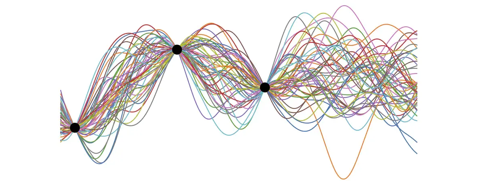

# Bayesian Optimization

## Why do we need Bayesian Optimization if there are tons of Optimization Algorithm?


Let's go into depth of Bayesian Optimization, Bayesian Optimization makes use of Gaussian Process
Let's try to undertand the Gaussian Process first before diving into nuts and bolt of Bayesian Optimization.

## Gaussian Process

Let’s start with some interesting properties of Normal distribution, these properties will later help us in deriving certain Gaussian Process equations. Assuming X and Y are two random independent variables that follow a normal distribution, then the following also holds true

then following follws normal distribution

```
1. x+y, x-y
2. P(X=x, Y=y)
3. P(X=x | Y=y)
4. Offcourse Marginalization of Joint distribution
5. xy (under certain condition)
```

These properties are extensively used in many supervised algorithms for parameters estimation using MLE (Most Likelihood Estimate) and MAP (Maximum A Posteriori), let's look at the difference between them, In MLE we are trying to find parameters that are most likely to generate the observed data (P(D|w)), whereas in MAP we also take care of the prior distribution of parameters in addition to MLE (P(w|D)). MAP seems to be more reasonable than MLE since we are giving some weightage to our prior belief.

MLE is special case of MAP where our prior belief is uniform distribution.

Let D be our training dataset.
$$
D = \{(x_i, y_i)\} \quad \text{where} \quad |D| = n, \quad x_i \in \mathbb{R}^m, \quad y_i \in \mathbb{R}
$$

Let us assume x is a test point, y be corresponding unknown prediction, then we are trying to get an estimate of y which is P(y| x, D). This can be rewritten as the marginalization of P(y, w| x, D)


$$
P(y|x, D)
$$

$$
\int P(y, w| x, D) \,dw
$$ 

$$ 
\int P(y | x, w) P(w|D) \,dw
$$ 
$$
\underbrace{P(w \mid D)}_{\text{Posterior}} = \frac{\overbrace{P(D \mid w)}^{\text{Likelihood}} \overbrace{P(w)}^{\text{Prior}}}{\underbrace{P(D)}_{\text{Evidence}}}
$$

We can see P(y| x, D) is the marginalization of P(y, w| x, D) with respect to w, therefore the prediction value at x is weighted prediction over all possible vectors w. Let us try to understand equation 3 intuitively.

The first part P(y|x, w) is representing the distribution of y given weights(w) and features(x). The second part is referring to the prediction weightage given the training dataset and how probable are the weights.

In summary, we are going over all the weights possibilities, getting their corresponding influence on our test data (P(w|D)), and their prediction (P(y|x, w)). P(y|x, D) follows a normal distribution, this can be proved using product properties mentioned in the Introduction section.


.webp>)
At each point, It follows a normal distribution with the same variance, this is the same as P(y| x, w)


The separate line indicates the different functions, and black dots represent actual data points, for getting inference at any point test data x, and different models and their corresponding weights can be used to generate confidence intervals.


### Mathematical Formulation


