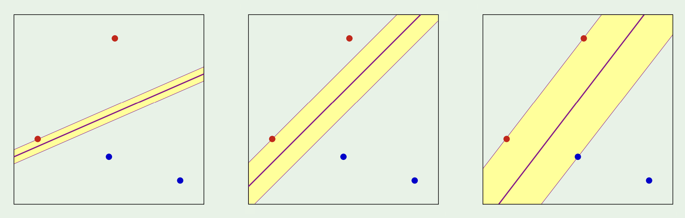

# Support Vector Machines in Depth

## Problem Formulation

Classifying with good margin is always preferred over small margin

## `Fiding W with large margin`
Let $x_{n}$ be the nearest point to the hyperpalne, $w^{T}$ x + b = 0.

Let  |$w^{T}$ $x_{n}$ + b| = 1

Lets take x' and x'' be two points lie on plane $w^{T}$ x + b = 0, note $w^{T}$ is a normal vector to plane.

$w^{T}$ x' + b = 0 \
$w^{T}$ x'' + b = 0

$w^{T}$(x' - x'') = 0

## Distance between $x_{n}$ and plane 

Lets define unit vector, the purpose of unit normal vector is to get perpendicular distance between plane and $x_{n}$
$$
\hat{w} = \frac{w}{|w|}
$$

$$
\frac{w^{t}(x_{n} - x')}{|w|}
$$

$$
\frac{w^{t}(x_{n} + b - x' - b)}{|w|}
$$

$$
max \left(\frac{1}{|w|}\right)
$$

## The Optimization Problem

If we maximize the distance between nearest point, we will get maximum margin classifier.

this is same as minimizing \
$|w|$ or $w^t w$
such that |$w^{T}$ $x_{n}$ + b| = 1

formally, we can write minimzation problem

$$
\frac{1}{2}\left( w^tw \right) \
$$

such that 

$$
y_{n}(w^tx_{n} + b) \ge 1
$$

